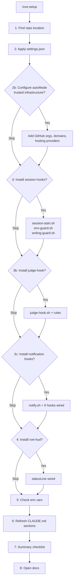

# /xve:setup

Run this once on a new machine after installing the plugin. It wires up Claude Code with the full XVE configuration.

## Flow

## What each step does

### 1: Find repo location

Detects where the marketplace is checked out so hook scripts and config files can be referenced by path. Asks for the path if it cannot find it automatically.

### 2: Apply settings.json

Merges `plugins/xve/config/settings.json` into `~/.claude/settings.json`, preserving any machine-specific keys. Sets:

- Model strategy: `sonnet[1m]` as default, Opus 4.7 as advisor for strategic decisions
- Permission mode: `bypassPermissions` (no per-call prompts; judge-hook + deny list are the gate)
- Allow/deny lists, token and timeout limits
- Env vars: `ENABLE_TOOL_SEARCH`, `DISABLE_ADAPTIVE_THINKING`, `CLAUDE_CODE_MAX_OUTPUT_TOKENS`, etc.
- Hooks: assertion checker on `UserPromptSubmit`

### 2b: Configure autoMode trusted infrastructure

The autoMode classifier needs to know which GitHub orgs, internal domains, and hosting providers are yours before it can make good decisions. Without this it may pause on routine pushes or SSH deployments.

Three questions, all optional:
- GitHub orgs (e.g. `github.com/your-org`)
- Internal domains (e.g. `*.example.com`)
- Hosting targets (plain English, e.g. `Combell: PHP/WordPress via SSH and rsync`)

Run `/xve:automode-env` at any time to configure this later.

### 3: Install session hooks (asks first)

Three hook scripts downloaded from GitHub and placed in `~/.claude/`:

| Script | Hook type | What it does |
|--------|-----------|-------------|
| `session-start.sh` | `SessionStart` | Injects context; reads `DISABLE_ADVISOR` to toggle Opus advisor |
| `env-guard.sh` | `PreToolUse` | Blocks any read, write, or bash command referencing `.env` files |
| `writing-guard.sh` | `PostToolUse` | Scans file content on Write/Edit for AI writing tells (em dashes, banned vocab); blocks and asks Claude to revise |

### 3b: Install judge-hook (opt-in, default No)

A `PreToolUse` hook that pattern-matches risky tool inputs before they execute. Ships with example rules and an eval scaffold.

- Deterministic regex layer: `deny`, `allow`, `escalate` rule classes
- Optional LLM escalation via Haiku (~$0.001 per fire, ~2s latency) for context-sensitive decisions
- Widens `permissions.allow` to `["*"]` when installed; the deny list and hook rules become the safety gate

Full guide: [judge-hook.md](judge-hook.md)

### 3c: Install notification hooks (opt-in, default Yes)

Installs `notify.sh` and wires 6 lifecycle hook events to native OS notifications (macOS, Windows, Linux). Lets you step away during long runs.

| Hook | When |
|------|------|
| `PreCompact` | Context window about to compact |
| `PostCompact` | Compaction done, context reset |
| `Stop` | Claude finished a turn (fires on every response) |
| `StopFailure` | API error: rate limit, billing, server error |
| `TeammateIdle` | Teammate agent going idle |
| `Notification` | Claude idle, waiting for input (`idle_prompt` only) |

Full guide: [notification-hooks.md](notification-hooks.md)

### 4: Install xve-hud statusline (asks first)

Wires the `xve-hud.sh` statusline script into `~/.claude/settings.json`. Shows a handoff-urgency banner: amber at 60% context, red at 85%, early bump if quota burns fast. Requires `jq`.

### 5: Check env vars

Reports the state of `DISABLE_ADVISOR` (and others). No changes made; this is read-only.

| Var | Purpose |
|-----|---------|
| `DISABLE_ADVISOR` | Set to `1` to turn off Opus advisor calls |

### 6: Refresh CLAUDE.md sections

Force-overwrites the 6 XVE-managed sections in `~/.claude/CLAUDE.md` with canonical content. A timestamped backup is created first. Sections outside the managed set are left untouched.

Managed sections: Advisor, LLM Council, Decisive Thinking, Coding Guidelines, Review Mindset, Writing Guidelines.

### 7: Summary checklist

Prints what was applied, what was skipped, and what still needs attention.

### 8: Open docs

Runs `/xve:docs` to open the getting started guide in the browser.

## After setup

Restart Claude Code for hooks and the statusline to take effect.
