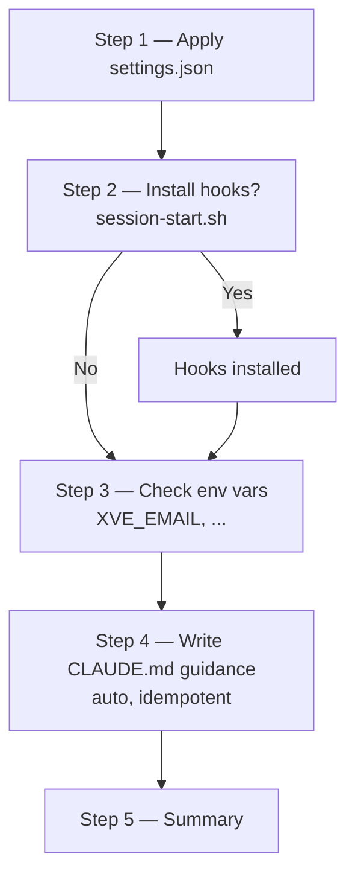

# /xve-setup

Run this once on a new machine after installing the plugins. It wires up Claude Code with the full XVE configuration.

## Flow

## What it does

### 1 — Applies settings

Merges `plugins/xve/config/settings.json` into `~/.claude/settings.json`. This configures:

- **Model strategy:** `opusplan` as executor + Opus 4.7 as advisor for strategic decisions
- **Permissions:** pre-approved allow/deny lists so Claude doesn't prompt for common commands
- **Token and timeout limits**

### 2 — Installs hooks (asks first)

Claude asks whether you want these before installing:

- **`session-start.sh`** — runs at session start, reads your env vars and injects context (enables/disables advisor based on flags)

### 3 — Checks env vars

Reads your environment and reports what's set and what's missing:

| Var | Purpose |
|-----|---------|
| `XVE_EMAIL` | Your email, used by Claude to identify your account |
| `DISABLE_ADVISOR` | Set to `1` to turn off Opus advisor calls |

If `XVE_EMAIL` is not set, Claude asks you for it interactively and appends `export XVE_EMAIL=...` to your `~/.zshrc`. Restart your terminal afterward so the var loads.

### 4 — Writes guidance to CLAUDE.md

Appends two sections to `~/.claude/CLAUDE.md` (each idempotent — skipped if already present):

- **Advisor** — when and how to call advisor() for strategic oversight
- **Coding Guidelines** — the four Karpathy principles baked in as always-on instructions

This means the guidelines are active in every session without needing to run `/karpathy-guidelines` manually.

### 5 — Summary

Prints a checklist at the end showing what was applied, what was skipped, and what still needs attention.

## After setup

Restart your terminal (to load the new `~/.zshrc` entries), then open a new Claude Code session. The hooks and agents will be active immediately.
