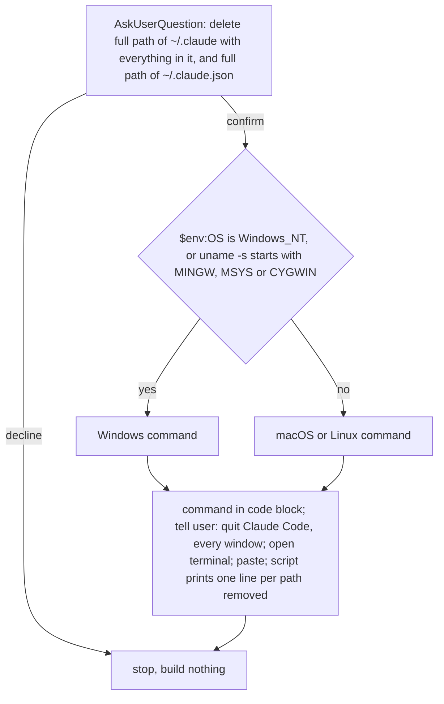

Never run script because running Claude Code keeps writing to `~/.claude` and, on Windows, locks files in it; user runs script after quitting Claude Code.

Script deletes `~/.claude` and `~/.claude.json` (Windows: under `%USERPROFILE%`): settings, memory, plugins, hooks, sessions, history, MCP servers, account state. `claude` binary stays installed; binary removal -> `uninstall-cli` skill.

Windows command: `powershell -NoProfile -ExecutionPolicy Bypass -File "${CLAUDE_SKILL_DIR}/purge.ps1"`

macOS or Linux command: `bash "${CLAUDE_SKILL_DIR}/purge.sh"`
