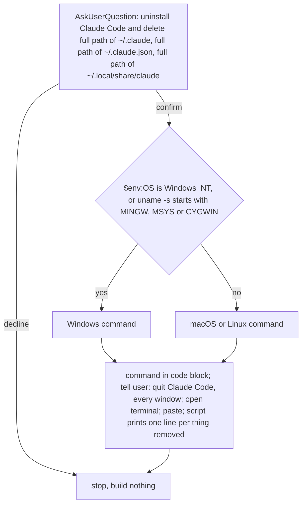

Never run script because Windows cannot delete running `claude.exe` and running Claude Code keeps writing to `~/.claude`; user runs script after quitting Claude Code.

Script removes binary: Homebrew cask `claude-code` (macOS), npm package `@anthropic-ai/claude-code`, else file `claude` resolves to on PATH.

Script removes data: `~/.local/share/claude` (native install versions), `~/.claude`, `~/.claude.json` (Windows: under `%USERPROFILE%`).

Script removes lines referencing Claude, plus `# >>> core:env >>>` block from `/core:setup`, in shell rc files (`.zshrc`, `.zprofile`, `.bashrc`, `.bash_profile`, `.profile`, fish `config.fish`) and, on Windows, PowerShell profiles.

Windows command: `powershell -NoProfile -ExecutionPolicy Bypass -File "${CLAUDE_SKILL_DIR}/uninstall.ps1"`

macOS or Linux command: `bash "${CLAUDE_SKILL_DIR}/uninstall.sh"`
