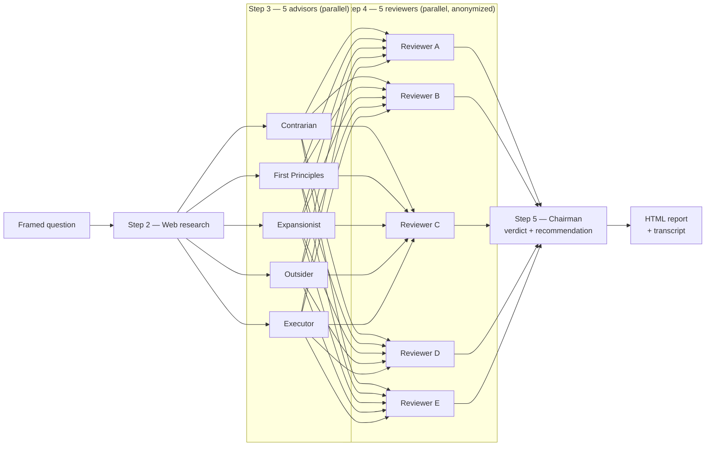

# LLM Council

## When to Use

**Good:** genuine uncertainty, cost of bad call is high — "Should I launch a $97 workshop or $497 course?", "Should I hire a VA or build automation first?"

**Bad:** factual lookup, creation tasks (write a tweet, summarize this), already decided.

## The Five Advisors

These descriptions are injected verbatim into each subagent prompt — they drive voice and output quality.

| Advisor | Description |
|---------|-------------|
| **The Contrarian** | Actively looks for what's wrong, what's missing, what will fail. Not a pessimist — the friend who saves you from a bad deal by asking the questions you're avoiding. If everything looks solid, digs deeper. |
| **The First Principles Thinker** | Ignores the surface question and asks "what are we actually trying to solve?" Strips away assumptions, rebuilds from the ground up. Often the most valuable output is "you're asking the wrong question entirely." |
| **The Expansionist** | Looks for upside everyone else is missing. What could be bigger? What adjacent opportunity is hiding? Doesn't care about risk — that's the Contrarian's job. Focuses on what happens if this works even better than expected. |
| **The Outsider** | Has zero context about you, your field, or your history. Responds purely to what's in front of them. Catches the curse of knowledge: things obvious to you but confusing to everyone else. |
| **The Executor** | Only cares about one thing: can this be done, and what's the fastest path? Ignores theory and strategy. If an idea has no clear first step, says so. |

## Session Overview



## Session Steps

### Step 1 — Frame the Question

Scan workspace for context (`CLAUDE.md`, `memory/`, referenced files, past transcripts) — 30 seconds max. Frame includes: core decision, user context, workspace context, what's at stake. If too vague, ask **one** clarifying question.

### Step 2 — Web Research

Before convening advisors, search for real-world signal on the decision. Run 2–3 targeted searches:
- Best practices or common outcomes for this type of decision
- Known failure modes or pitfalls others have hit
- Any recent data, benchmarks, or case studies relevant to the stakes

Summarise findings in 3–5 bullet points. This context is appended to the framed question given to every advisor — grounding them in what's actually known rather than reasoning in a vacuum.

Skip only if the question is purely personal/values-based with no meaningful external signal (e.g. "should I quit my job").

### Step 3 — Convene the Council (parallel)

Issue all 5 Agent calls in a **single message** (subagent_type: `general-purpose`). Sequential spawning lets earlier responses bleed into later ones — independence is the point.

Each advisor gets identity + framed question + instruction to respond independently, not hedge, lean into their angle, 150–300 words, no preamble.

```
You are [Advisor Name] on an LLM Council.
Your thinking style: [description from table above — paste in full]
Question: [framed question]
Respond from your perspective. Be direct. Don't hedge. 150-300 words. No preamble.
```

### Step 4 — Peer Review (parallel)

Anonymize responses as A–E (randomize mapping). Issue all 5 reviewer Agent calls in a **single message**. Each reviewer sees all 5 responses:
1. Which is strongest and why? (pick one)
2. Which has the biggest blind spot?
3. What did ALL responses miss?

```
You are reviewing an LLM Council. Five advisors answered: [framed question]
[Response A through E]
Answer the 3 questions. Reference by letter. Under 200 words. Be direct.
```

### Step 5 — Chairman Synthesis

One agent gets: original question + all 5 de-anonymized responses + all 5 peer reviews.

Output structure (mandatory):
1. **Where the Council Agrees** — converged points = high-confidence signals
2. **Where the Council Clashes** — genuine disagreements, both sides, why advisors differ
3. **Blind Spots the Council Caught** — emerged only through peer review
4. **The Recommendation** — direct, not "it depends", real answer with reasoning
5. **The One Thing to Do First** — single concrete next step

Chairman can disagree with majority if reasoning supports it.

### Step 6 — HTML Report

Save `council-report-[YYYY-MM-DD-HHMMSS].html` (self-contained, inline CSS):
- Chairman verdict prominent
- Agreement/disagreement visual (grid or spectrum)
- Collapsible advisor sections (collapsed by default)
- Collapsible peer review highlights
- Footer with timestamp

Open after generating.

### Step 7 — Transcript

Save `council-transcript-[YYYY-MM-DD-HHMMSS].md` alongside: original question, framed question, all advisor responses, all peer reviews (with anonymization mapping), full chairman synthesis.

## Rules

- Spawn advisors in parallel — sequential bleeds earlier responses into later ones
- Anonymize for peer review — prevents deference to certain thinking styles
